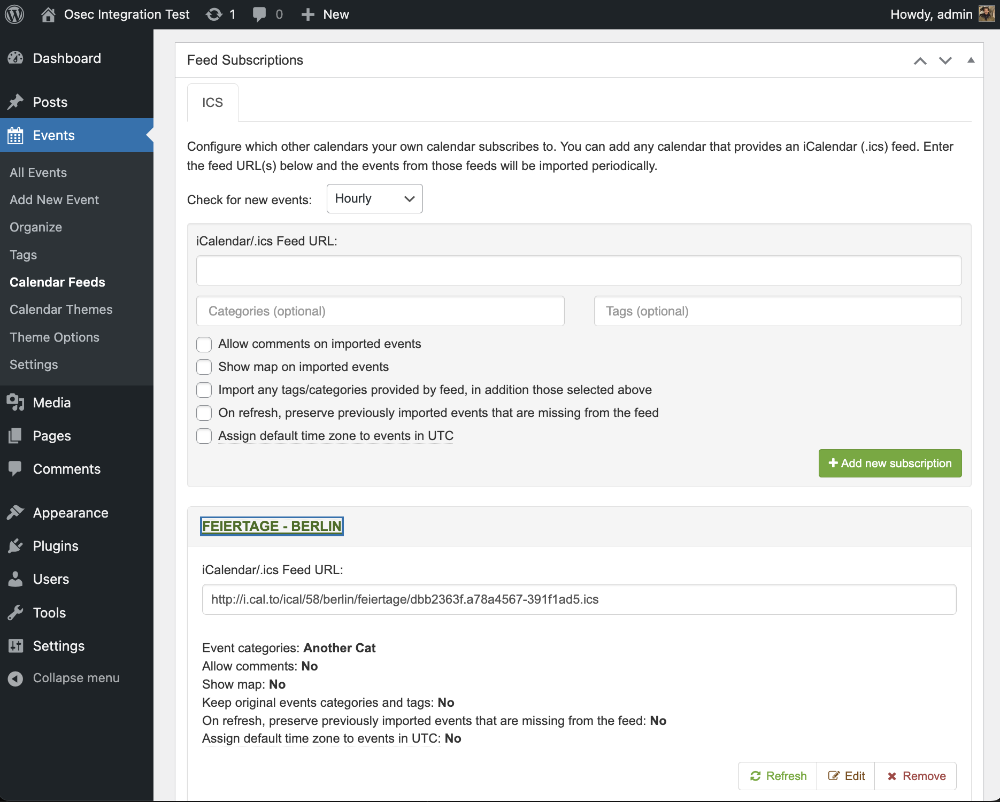
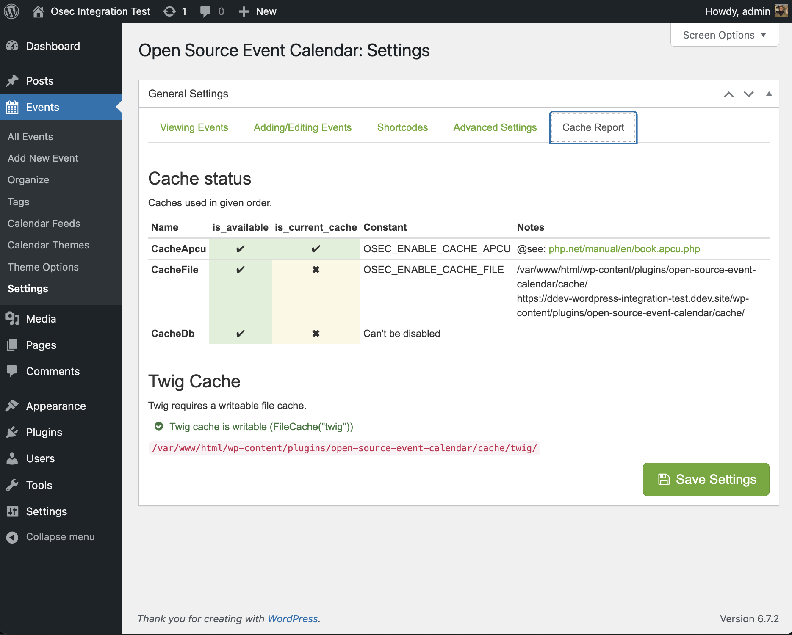

# Open Source Event Calendar (OSEC)

> A fully open-source WordPress event calendar with native iCal / ICS import and export.

**Open Source Event Calendar (OSEC)** is a WordPress plugin for creating, managing, sharing, and aggregating events in a self-hosted and fully open-source manner.
It is based on **All-in-One Event Calendar v2.3.4 by Timely**, but reintroduces removed core features and does not depend on proprietary services.

This plugin is open source software in the traditional sense. I pledge this plugin will not urge you to connect to any proprietary/payed service to use described features. All source code is available on [GitHub](https://github.com/digitaldonkey/open-source-event-calendar).

💖 **Donate:** [PayPal](https://www.paypal.com/donate/?hosted_button_id=ZNWEQRQNJBTE6)

---

## Table of Contents

- [Features](#features)
- [Import & Export (iCal / ICS)](#import--export-ical--ics)
- [Blocks & Shortcodes](#blocks)
- [Requirements](#requirements)
- [Installation](#installation)
- [Fork Notice](#this-is-a-fork)
- [Migration Notes](#migration-notes)
- [Development & Support](#development--support)
- [FAQ](#frequently-asked-questions)
- [Future Plans](#future-plans)
- [Screenshots](#screenshots)

---

## Features
All features are provided in their entirety. No features are locked behind any add-ons.
- **Full iCal / ICS import & export**
  - Automatically import external calendars
  - Categorize and tag imported feeds
- **Recurring events**, including complex recurrence rules [(RFC 5545)](https://icalendar.org/iCalendar-RFC-5545/3-8-5-3-recurrence-rule.html)
- **Filtering** by category and tag
- **Calendar sharing** with Google Calendar, Apple iCal, Outlook, and any other system that accepts iCalendar (.ics) feeds
- **Month, week, day, and agenda views**
- **Upcoming Events** Gutenberg block
- Direct links to **filtered calendar views**
- **Color-coded events** by category
- **Featured event images** and category images
- **SEO-optimized** event pages
- **Mobile-friendly** and responsive layouts
- ~~Embedded **Google Maps** for~~ event locations (Broken, plans to implement OpenStreetMap embedding)
- **Theme options** to customize your calendar appearence (based on bootstrap 3)
- Your calendar can be embedded into a WordPress page without needing to create template files or modify the theme.

---

## Import & Export (iCal / ICS)

Osec offers **full ics/ical support**. You can import events from other calendars and offer users the ability to subscribe to your calendar.

Importing and exporting iCalendar (.ics) feeds is one of the strongest features of the Event Calendar system. This allows you to manage your websites calendar by providing a public calendar from your Google, Apple or other calendar management software.

You can even send events from a specific category or tag (or combination of categories and tags).

---

## Blocks

You can embed the calendar by adding a **OSEC Calendar Block** to any page or post. Alternatively there is a shortcode available.

> [!WARNING] 
> At this time, only **one calendar per page or post** is supported.

On the long run it's planed to have a Rest API to allow the calendar being rendered with more modern frontend tools than the current, outdated, but nice old Bootstrap 3 stuff.

### Shortcodes

#### Calendar Views

    [osec]                       // Default view per settings
    [osec view="monthly"]
    [osec view="weekly"]
    [osec view="agenda"]
    [osec view="daily"]

#### Filtering

**By category**

    [osec cat_name="Holidays"]
    [osec cat_name="Lunar Cycles,zodia-date-ranges"]
    [osec cat_id="1"]
    [osec cat_id="1,2"]

**By tag**

    [osec tag_name="tips-and-tricks"]
    [osec tag_name="creative writing,performing arts"]
    [osec tag_id="1"]
    [osec tag_id="1,2"]

**By post ID**

    [osec post_id="1"]
    [osec post_id="1,2"]

---

## Requirements

- WordPress: 6.6 or newer
- PHP:
  - PHP 8.2+ required for development
  - PHP 8.1 may work for production builds when installed with `composer install --no-dev`

## Installation
Install as any other plugin, or from GitHub with the following steps:
1. Download .zip from release tab on right
2. Upload .zip to WordPress Plugins tab

### Setup:
1. Open the plugin settings page and save once
2. Configure:
  - Timezone
  - UI date formats
  - Week start day

3. Review `WordPress → Settings → General` for output date formats.
4. (Optional) Override constants file:
Copy [constants-local.php.example](https://raw.githubusercontent.com/digitaldonkey/open-source-event-calendar/refs/heads/master/constants-local.php.example) and save as `constants-local.php`

To remove all plugin data on uninstall, set: `define('OSEC_UNINSTALL_PLUGIN_DATA', true);`

---

## Languages

OSEC supports multiple languages

## This Is a Fork

OSEC is a fork of the GPL licensed plugin All-in-one-Event-Calendar by Timely. At it's time a great plugin with a solid but unmaintainable codebase (not all required developer tools where opensourced).

In later releases of the original softeware was deprived of core feature: Importing iCal feeds in favor of a service provided by Timely.

If you love truly open source software and don't mind to get your hands dirty you should join here. Free people need free software to manage and share events in a selfhosted manner.

## Migration Notes
Database structure is not fully compatible with All-in-One Event Calendar v2.3.4

Migration may be possible with manual effort

A standardized upgrade path may be developed if there is demand and contributions

See this [wiki](https://github.com/digitaldonkey/open-source-event-calendar/wiki/migration-from-all%E2%80%90in%E2%80%90one%E2%80%90event%E2%80%90calendar) for currently known information on migrating.

---

## Development & Support

The principle behind this plugin is to be Open Source. Get in touch on [GitHub](https://github.com/digitaldonkey/open-source-event-calendar) to report issues, propose feature enhancements, and get general guidance for contributing.

Writing this fork was [a huge effort](https://github.com/wp-plugins/all-in-one-event-calendar/compare/master...digitaldonkey:open-source-event-calendar:master).

Digitaldonkey believes everybody should be able to set up and manage public calendars. 

If you are implementing this plugin for others you should support ongoing development with a [donation](https://www.paypal.com/donate/?hosted_button_id=ZNWEQRQNJBTE6) or [contribution](https://github.com/digitaldonkey/open-source-event-calendar/issues). 

[Be a maker](https://dri.es/solving-the-maker-taker-problem)😀

Those wishing to contribute to the development of this project, please see the [Development Guide](https://github.com/digitaldonkey/open-source-event-calendar/blob/master/DEVELOPERS.md) for more information.

## Frequently Asked Questions

### "I really need feature XYZ"

Let's draft it out on [GitHub](https://github.com/digitaldonkey/open-source-event-calendar). You could donnate/pay me development time to get it contributed. Invoices possible. Or feel free to implement the requested feature yourself and create a Pull Request for it.
I may also provide paid support.

## Future plans (order irrelavent, features not guaranteed)
- Remove broken Google Maps integration and replace with OpenStreetMaps [(#5)](https://github.com/digitaldonkey/open-source-event-calendar/issues/5)
- Create modern looking theme to replace outdated default [(#2)](https://github.com/digitaldonkey/open-source-event-calendar/issues/2)

---

## Screenshots

Month View

Week View

Agenda View

Calendar Block UI

Manage iCal Feeds

Recurring Events

Cache Settings

Mobile Agenda View

## Contributors
### WordPress:
digitaldonkey, hubrik, vtowel, yaniiliev, nicolapeluchetti, jbutkus, lpawlik, bangelov

### GitHub:

> Contributor list made with [contrib.rocks](https://contrib.rocks).
