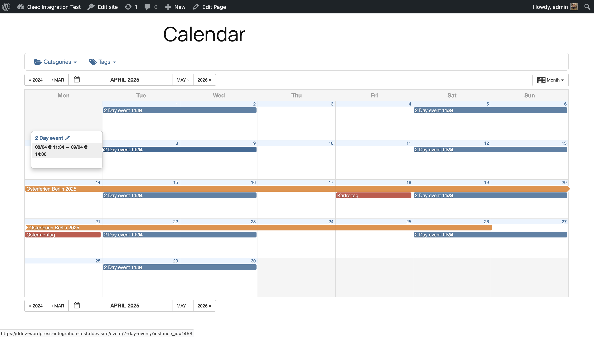
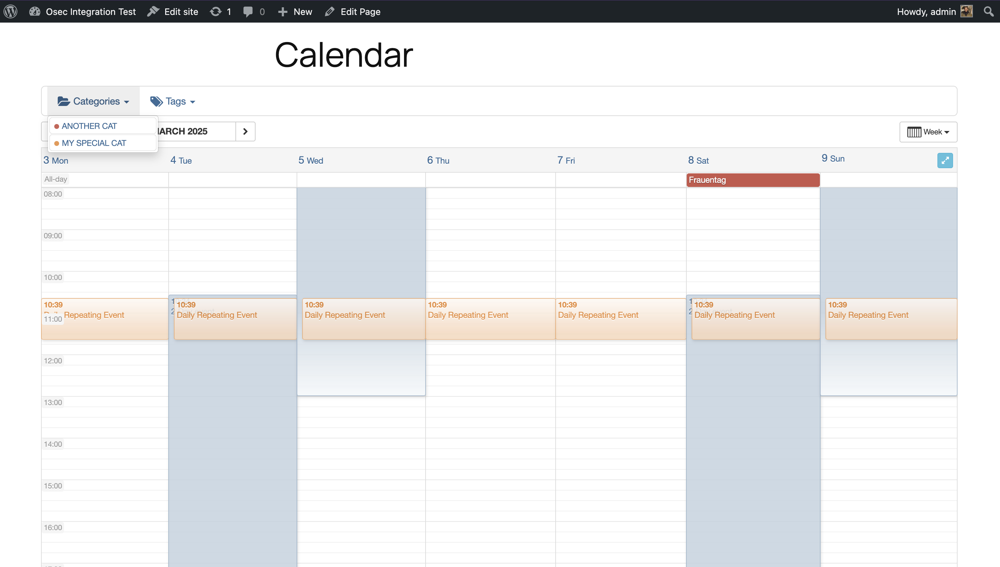
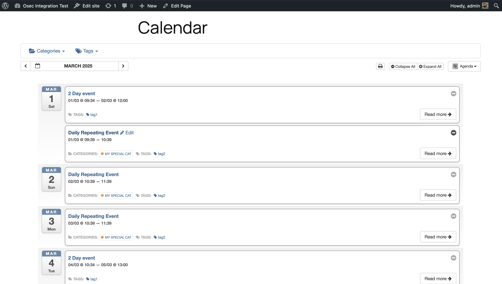
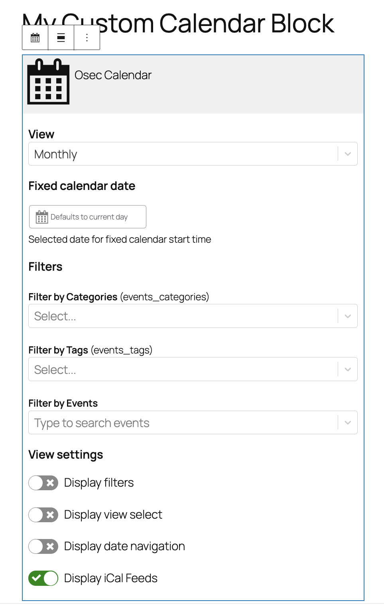
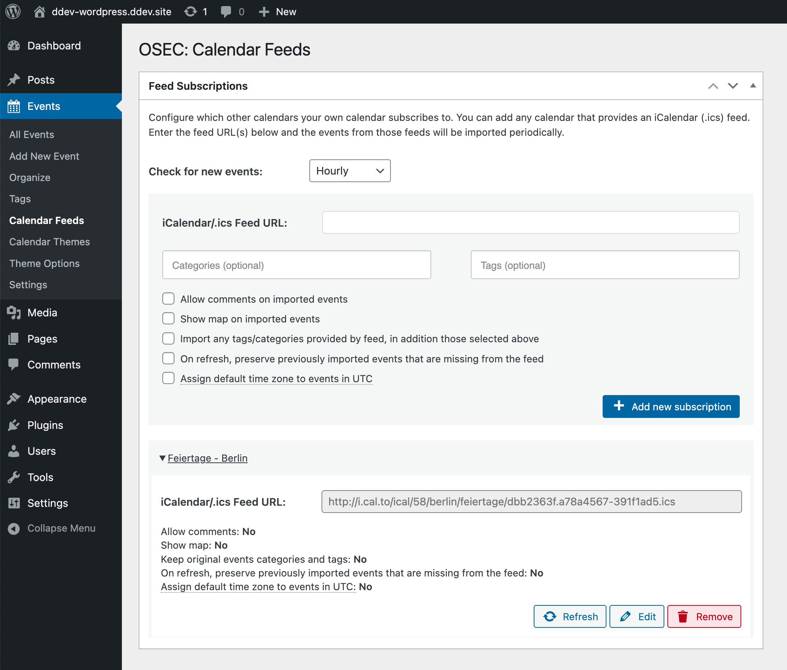
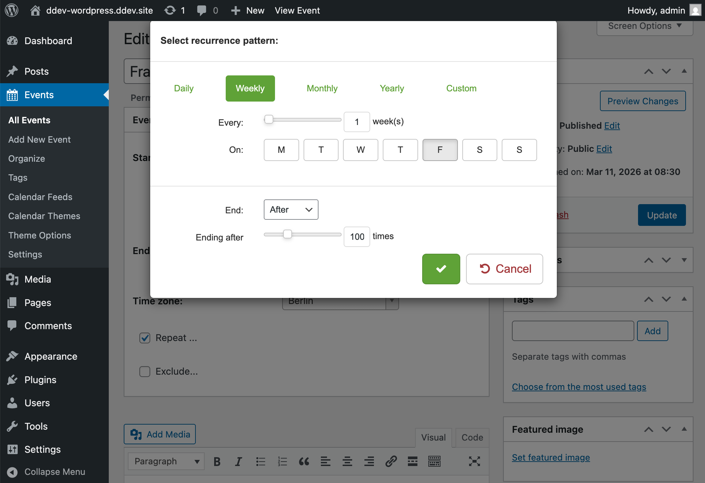
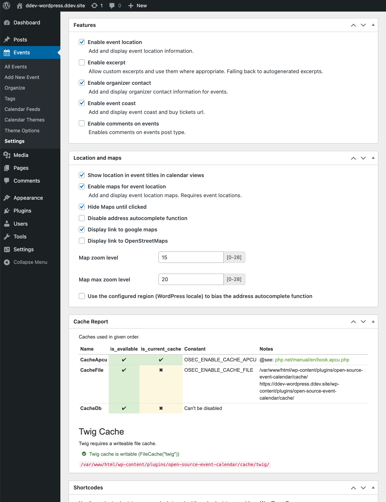
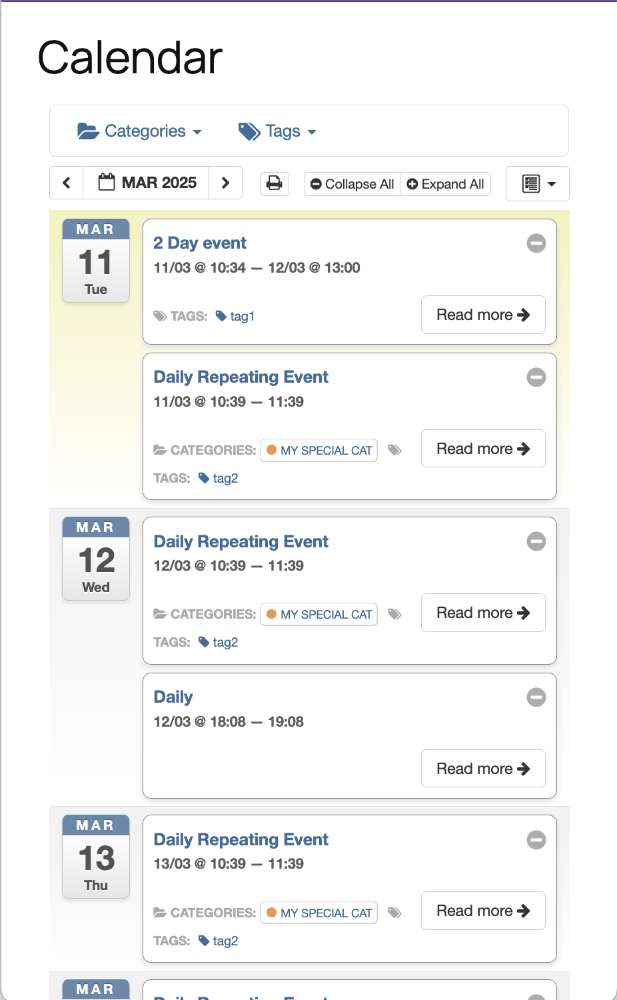
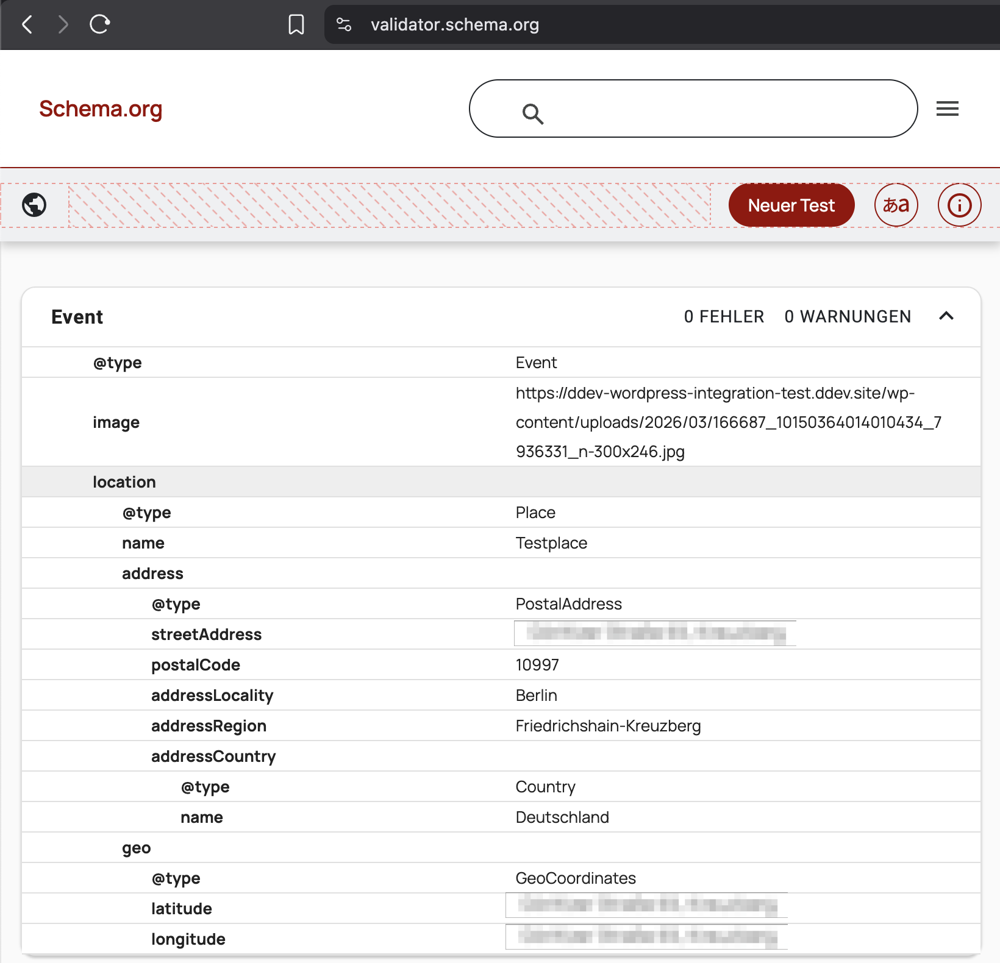

# Open Source Event Calendar (OSEC)

> A fully open-source WordPress event calendar with native iCal / ICS import and export.


**Open Source Event Calendar (OSEC)** is a WordPress plugin for creating, managing, sharing, and aggregating events in a self-hosted and fully open-source manner.
It is based on **All-in-One Event Calendar v2.3.4 by Timely**, but reintroduces removed core features and does not depend on proprietary services.

This plugin is open source software in the traditional sense. I pledge this plugin will not urge you to connect to any proprietary/payed service to use described features. All source code is available on [GitHub](https://github.com/digitaldonkey/open-source-event-calendar).

💖 **Donate:** [PayPal](https://www.paypal.com/donate/?hosted_button_id=ZNWEQRQNJBTE6)

---

## Table of Contents

- [Features](#features)
- [Import & Export (iCal / ICS)](#import--export-ical--ics)
- [Blocks & Shortcodes](#blocks)
- [Requirements](#requirements)
- [Installation](#installation)
- [WP-CLI](#wp-cli)
- [Fork Notice](#this-is-a-fork)
- [Migration Notes](#migration-notes)
- [Development & Support](#development--support)
- [FAQ](#frequently-asked-questions)
- [Future Plans](#future-plans)
- [Screenshots](#screenshots)

---

## Features
All features are provided in their entirety. **No features are locked behind any add-ons**.

- **Full iCal / ICS import & export**
  - Automatically import external calendars
  - Categorize and tag imported feeds
- **Recurring events**, including complex recurrence rules [(RFC 5545)](https://icalendar.org/iCalendar-RFC-5545/3-8-5-3-recurrence-rule.html)
- Filtering by category and tag
- **Calendar sharing** with Google Calendar, Apple iCal, Outlook, and any other system that accepts iCalendar (.ics) feeds
- Month, week, day, and agenda views
- **Upcoming Events** Gutenberg block
- Direct links to **filtered calendar views**
- Color-coded events by category
- Featured event images and category images
- SEO-optimized event pages
- Mobile-friendly and responsive layouts
- Embedded **OpenStreetMap**
- Theme options to customize your calendar appearence
- Your calendar can be embedded into a WordPress page without needing to create template files or modify the theme.

**Import events from other calendars** and offer users the **ability to subscribe to your calendar**.

Importing and exporting iCalendar (.ics) feeds is one of the strongest features of the Event Calendar system. This allows you to manage your websites calendar by providing a public calendar from your Google, Apple or other calendar management software.

---

## Blocks

You can embed the calendar by adding a **OSEC Calendar Block** to any page or post. Alternatively there is a shortcode available.

> [!WARNING] 
> At this time, only **one calendar per page or post** is supported.

On the long run it's planned to have a Rest API to allow the calendar being rendered with more modern frontend tools than the current, outdated, but nice old Bootstrap 3 stuff.

### Shortcodes

#### Calendar Views

    [osec]                       // Default view per settings
    [osec view="monthly"]
    [osec view="weekly"]
    [osec view="agenda"]
    [osec view="daily"]

#### Filtering

**By category**

    [osec cat_name="Holidays"]
    [osec cat_name="Lunar Cycles,zodia-date-ranges"]
    [osec cat_id="1"]
    [osec cat_id="1,2"]

**By tag**

    [osec tag_name="tips-and-tricks"]
    [osec tag_name="creative writing,performing arts"]
    [osec tag_id="1"]
    [osec tag_id="1,2"]

**By post ID**

    [osec post_id="1"]
    [osec post_id="1,2"]

---

## Requirements

- WordPress: 6.7 or newer
- PHP:
  - PHP 8.2+ required for development
  - PHP 8.1 may work for production builds when installed with `composer install --no-dev`

## Installation

Install as any other plugin, or from GitHub.

**Setup steps**

1. Open the plugin settings page and save once
2. Configure:
    - Timezone
    - UI date formats
    - Week start day
3. Review `WordPress → Settings → General` for output date formats.
4. (Optional) Override constants file:
Copy [constants-local.php.example](https://raw.githubusercontent.com/digitaldonkey/open-source-event-calendar/refs/heads/master/constants-local.php.example) and save as `constants-local.php`

To remove all plugin data on uninstall, set: `define('OSEC_UNINSTALL_PLUGIN_DATA', true);`

---

## WP-CLI

**Rebuild recurring event instances.** Instances are only written when an event is saved. After an update that fixes recurrence, regenerate them. Rows left behind by deleted event posts are removed along the way.

    wp osec event regenerate --dry-run              # what would happen
    wp osec event regenerate --yes                  # all events
    wp osec event regenerate 123 456                # some events
    wp osec event regenerate --feed=3               # events of one feed
    wp osec event regenerate --yes --resave         # save like the editor does, firing all save hooks
    wp osec event regenerate --yes --start-after=4711   # resume an interrupted run

Events are processed in batches (`--batch-size`, default 500). Every batch line prints the `--start-after` value to resume with, so any number of events can be processed.

**Update feeds now**, instead of waiting for the scheduled import. Problems are printed to the console instead of being stored as admin notices.

    wp osec feed list
    wp osec feed update --yes                       # all feeds
    wp osec feed update 3                           # one feed
    wp osec feed update 3 --force                   # break the lock a crashed import left behind

Only use `--force` when no other import of that feed is running, or events may be imported twice. A feed is imported in one go: a feed of 10,000 events needs about 200 MB of PHP memory (`php -d memory_limit=256M $(which wp) osec feed update 3`).

To give a slow feed server more time than the default 120 seconds, use WordPress' `http_request_args` filter:

```php
add_filter('http_request_args', function ($args, $url) {
    if (str_starts_with($url, 'https://slow.example.org/')) {
        $args['timeout'] = 300;
    }
    return $args;
}, 10, 2);
```

The commands run per site. On multisite, loop over the sites:

    wp site list --field=url | xargs -I{} wp --url={} osec event regenerate --yes

Exit code is 1 if any event or feed failed.

---

## Languages

OSEC supports multiple languages

## This Is a Fork

OSEC is a fork of the GPL licensed plugin All-in-one-Event-Calendar by Timely. At it's time a great plugin with a solid but unmaintainable codebase (not all required developer tools where opensourced).

If you love truly open source software and don't mind to get your hands dirty you should join here. Free people need free software to manage and share events in a selfhosted manner.

## External services

OSEC may connect to OpenStreetMap to render maps. If you using maps feature make sure you agree with [Terms of Service](https://operations.osmfoundation.org/policies/)

OSEC may connect to OpenStreetMap Nominatim geocoding API. [Terms of Service](https://operations.osmfoundation.org/policies/nominatim/).
You may need to switch the servive on a heavy traffic site as Nominatim allows an *absolute maximum of 1 request per second*.

Leaflet and leaflet-control-geocoder are bundled with the plugin, so rendering a map does not request
them from a third party.

You can load them from elsewhere, for example a CDN, using the hooks `osec_leaflet_library_alter` and
`osec_leaflet_geocoder_library_alter`.

## Migration Notes
Database structure is not fully compatible with All-in-One Event Calendar v2.3.4

Migration may be possible with manual effort

A standardized upgrade path may be developed if there is demand and contributions

See this [wiki](https://github.com/digitaldonkey/open-source-event-calendar/wiki/migration-from-all%E2%80%90in%E2%80%90one%E2%80%90event%E2%80%90calendar) for currently known information on migrating.

---

## Development & Support

The principle behind this plugin is to be Open Source. Get in touch on [GitHub](https://github.com/digitaldonkey/open-source-event-calendar) to report issues, propose feature enhancements, and get general guidance for contributing.

Writing this fork was [a huge effort](https://github.com/wp-plugins/all-in-one-event-calendar/compare/master...digitaldonkey:open-source-event-calendar:master).

Digitaldonkey believes everybody should be able to set up and manage public calendars. 

If you are implementing this plugin for others you should support ongoing development with a [donation](https://www.paypal.com/donate/?hosted_button_id=ZNWEQRQNJBTE6) or [contribution](https://github.com/digitaldonkey/open-source-event-calendar/issues). 

[Be a maker](https://dri.es/solving-the-maker-taker-problem)😀

Those wishing to contribute to the development of this project, please see the [Development Guide](https://github.com/digitaldonkey/open-source-event-calendar/blob/master/.github/CONTRIBUTORS.md) for more information.

## Upgrade Notice

= 1.0.7 =

Categories and Tags renamed
Upgrading from pre 1.0.7 requires you to rename taxonomies due to prefix requirements.

```
# events_categories => osec_events_categories
UPDATE  `wp_term_taxonomy` SET  `taxonomy` =  'osec_events_categories' WHERE  `taxonomy` = 'events_categories';
# events_tags       => osec_events_tags
UPDATE  `wp_term_taxonomy` SET  `taxonomy` =  'osec_events_tags' WHERE  `taxonomy` = 'events_tags';
```

## Frequently Asked Questions

### "I really need feature XYZ"

Let's draft it out on [GitHub](https://github.com/digitaldonkey/open-source-event-calendar). You could donnate/pay me development time to get it contributed. Invoices possible. Or feel free to implement the requested feature yourself and create a Pull Request for it.
I may also provide paid support.

### Event descriptions show other content (page builders, share buttons, related posts)

Event descriptions in the agenda view and the ICS feed are passed through WordPress' `the_content` filter, in the context of the event, so plugins hooking into it behave as on the event itself. Most of them can be switched off per post type in their own settings.

If a plugin still adds unwanted content, enable *OSEC Settings → Advanced → Strict compatibility content filtering*. Event descriptions in agenda view and the ICS feed then only get basic formatting (`wptexturize`, `convert_smilies`, `convert_chars`, `wpautop`); developers can change that list with the `osec_event_the_content_strict_filters` filter.

### A feed fails with "cURL error 60: SSL certificate problem"

Feeds are fetched with certificate verification, so a server with a self-signed, expired or incomplete certificate is refused (before 1.1.15 certificates were not checked). Ask the feed's provider to fix the certificate, or use `http://` if the provider offers it. If you trust that server anyway, you can exempt just its host with WordPress' `http_request_args` filter:

```php
add_filter('http_request_args', function ($args, $url) {
    if ('calendar.example.org' === wp_parse_url($url, PHP_URL_HOST)) {
        $args['sslverify'] = false;
    }
    return $args;
}, 10, 2);
```

---

## Screenshots

Month View


Week View


Agenda View


Calendar Block UI


Manage iCal Feeds


Recurring Events


Cache Settings


Mobile Agenda View


Schema.org/Event data validator

## Contributors
### WordPress:
digitaldonkey, hubrik, vtowel, yaniiliev, nicolapeluchetti, jbutkus, lpawlik, bangelov

### GitHub:
<a href="https://github.com/digitaldonkey/open-source-event-calendar/graphs/contributors">
  
</a>

> Contributor list made with [contrib.rocks](https://contrib.rocks).
