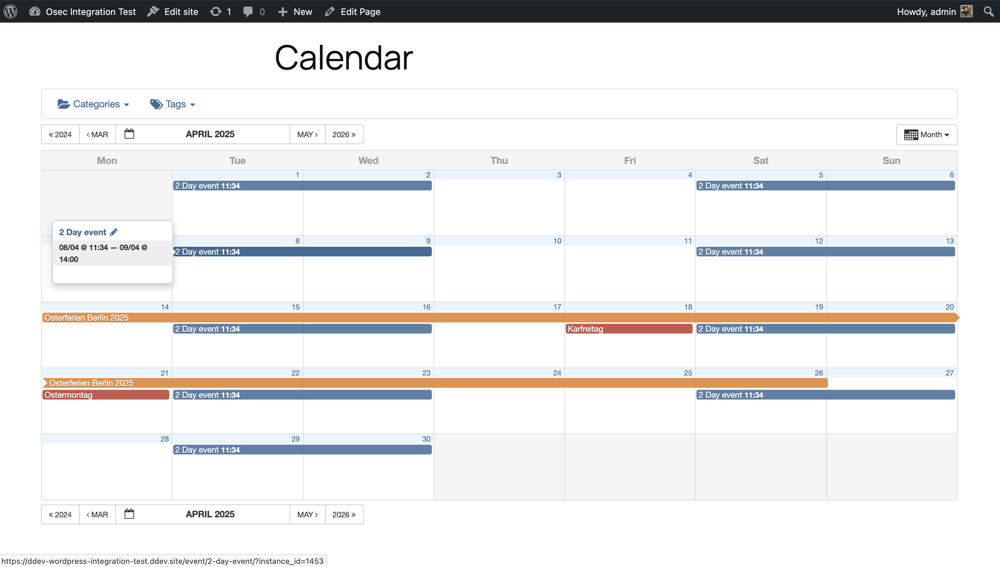
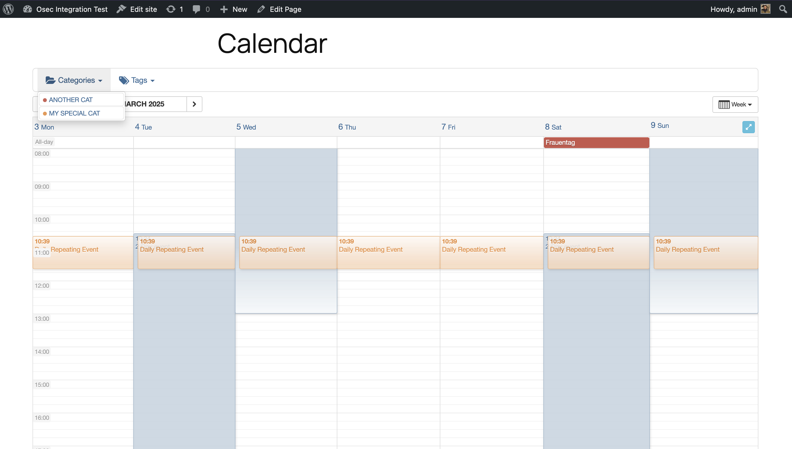

# Open Source Event Calendar (OSEC)


> A fully open-source WordPress event calendar with native iCal / ICS import and export.

**Open Source Event Calendar (OSEC)** is a WordPress plugin for creating, managing, sharing, and aggregating events in a self-hosted and fully open-source manner.  
It is based on **All-in-One Event Calendar v2.3.4 by Timely**, but restores removed core features and removes all proprietary service dependencies.

💖 **Donate:** https://www.paypal.com/donate/?hosted_button_id=ZNWEQRQNJBTE6

---

## Table of Contents

- [Features](#features)
- [Import & Export (iCal / ICS)](#import--export-ical--ics)
- [Blocks & Shortcodes](#blocks--shortcodes)
- [Requirements](#requirements)
- [Installation](#installation)
- [Languages](#languages)
- [Screenshots](#screenshots)
- [This Is a Fork](#this-is-a-fork)
- [Upgrade Notes](#upgrade-notes)
- [Development & Support](#development--support)
- [External Services](#external-services)

---

## Features

- **Full iCal / ICS import & export** — no paid add-ons
  - Automatically import external calendars
  - Categorize and tag imported feeds
- **Recurring events**, including complex recurrence rules (RFC 5545)
- **Filtering** by category and tag
- **Calendar sharing** with Google Calendar, Apple iCal, Outlook, and other ICS clients
- **Month, week, day, and agenda views**
- **Upcoming Events** Gutenberg block
- **Color-coded events** by category
- **Featured event images** and category images
- **SEO-optimized** event pages
- **Mobile-friendly** and responsive layouts
- ~~Embedded **Google Maps** for~~ event locations (Broken, plans to implement OpenStreetMap embedding)
- Theme customization (Bootstrap 3–based)
- Embed calendars without modifying theme templates

---

## Import & Export (iCal / ICS)

Native iCalendar support is one of OSEC’s core strengths.

- Import calendars from Google, Apple, Outlook, or any ICS feed
- Export your calendar so others can subscribe
- Filter exported feeds by:
  - Category
  - Tag
  - Combinations of categories and tags

This allows you to manage events using external tools while keeping WordPress as the public source of truth.

---

## Blocks & Shortcodes

### Gutenberg Block

Use the **OSEC Calendar** block to embed a calendar in any post or page.
> [!WARNING] 
> At this time, only **one calendar per page or post** is supported.

### Shortcodes

#### Calendar Views

```text
[osec]                       // Default view (from settings)
[osec view="monthly"]
[osec view="weekly"]
[osec view="agenda"]
[osec view="daily"]          // Posterboard / daily view
```

##### Filtering

By category
```text
[osec cat_name="Holidays"]
[osec cat_name="Lunar Cycles,zodia-date-ranges"]
[osec cat_id="1"]
[osec cat_id="1,2"]
```

By tag
```text
[osec tag_name="tips-and-tricks"]
[osec tag_name="creative writing,performing arts"]
[osec tag_id="1"]
[osec tag_id="1,2"]
```
By post ID
```text
[osec post_id="1"]
[osec post_id="1,2"]
```
### Requirements

- WordPress: 6.6 or newer
- PHP:
  - PHP 8.2+ required for development
  - PHP 8.1 may work for production builds when installed with `composer install --no-dev`

### Installation
1. Download .zip from release tab on right
2. Upload .zip to WordPress Plugins tab

#### Setup:
1.Open the plugin settings page and save once
2.Configure:
  - Timezone
  - UI date formats
  - Week start day
3. Review WordPress → Settings → General for output date formats.
4. (Optional) Override constants file:
Copy `https://raw.githubusercontent.com/digitaldonkey/open-source-event-calendar/refs/heads/master/constants-local.php.example` and save as `constants-local.php`

    To remove all plugin data on uninstall, set: `define('OSEC_UNINSTALL_PLUGIN_DATA', true);`

### Languages

OSEC supports multiple languages and follows current WordPress translation standards.

### Screenshots

Month View


Week View


Agenda View


Calendar Block UI


Manage iCal Feeds


Recurring Events


Cache Settings


Mobile Agenda View

### This Is a Fork

OSEC is a fork of the GPL-licensed All-in-One Event Calendar by Timely.
- Original plugin had a solid feature set but an increasingly unmaintainable codebase
- Later versions removed iCal import in favor of proprietary services
- OSEC restores:
  - Open standards
  - Self-hosting
  - Community-driven development

### Upgrade Notes
Database structure is not fully compatible with All-in-One Event Calendar v2.3.4

Migration may be possible with manual effort

A standardized upgrade path may be developed if there is demand and contributions

See this  for currently known information on migrating.

### Development & Support

The principle behind this plugin is to be Open Source.
So you might get in touch on github accelerate development.

Writing this fork was [a huge effort](https://github.com/wp-plugins/all-in-one-event-calendar/compare/master...digitaldonkey:open-source-event-calendar:master).

Digitaldonkey believes everybody should be able to set up and manage public calendars. 

If you are implementing this plugin for others you should support ongoing development with a [donnation](https://www.paypal.com/donate/?hosted_button_id=ZNWEQRQNJBTE6) or [contribution](https://github.com/digitaldonkey/open-source-event-calendar/issues). 

[Be a maker](https://dri.es/solving-the-maker-taker-problem)😀

##### I really need feature XYZ

Let's draft it out on github. You could donnate/pay me development time to get it contributed. Invoices possible. Or feel free to implement the requested feature yourself and create a Pull Request for it.

### Future plans (order irrelavent, feautres not guarenteed)
- Remove broken Google Maps integration and replace with OpenStreetMaps (#5)
- Create modern looking theme to replace outdated default (#2)